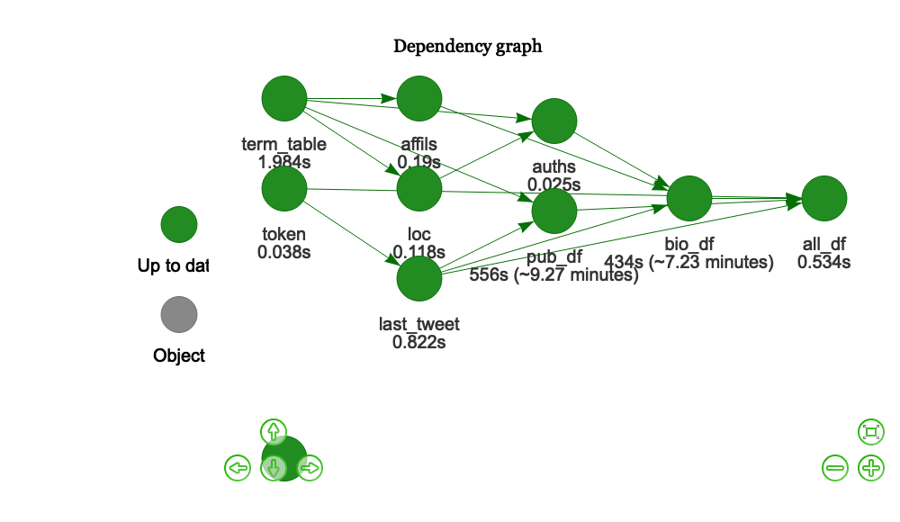

CuocoBot1 build report
================
Mike Cuoco
2020-06-11

``` r
source("R/functions.R") 
source("R/plan.R") 

make(plan)
```

    ## ✓ All targets are already up to date.

``` r
vis_drake_graph(plan, targets_only = T, navigationButtons = T)
```

<!-- -->

``` r
build_times() %>% gt()
```

<!--html_preserve-->

<style>html {
  font-family: -apple-system, BlinkMacSystemFont, 'Segoe UI', Roboto, Oxygen, Ubuntu, Cantarell, 'Helvetica Neue', 'Fira Sans', 'Droid Sans', Arial, sans-serif;
}

#rnahshwber .gt_table {
  display: table;
  border-collapse: collapse;
  margin-left: auto;
  margin-right: auto;
  color: #333333;
  font-size: 16px;
  background-color: #FFFFFF;
  width: auto;
  border-top-style: solid;
  border-top-width: 2px;
  border-top-color: #A8A8A8;
  border-right-style: none;
  border-right-width: 2px;
  border-right-color: #D3D3D3;
  border-bottom-style: solid;
  border-bottom-width: 2px;
  border-bottom-color: #A8A8A8;
  border-left-style: none;
  border-left-width: 2px;
  border-left-color: #D3D3D3;
}

#rnahshwber .gt_heading {
  background-color: #FFFFFF;
  text-align: center;
  border-bottom-color: #FFFFFF;
  border-left-style: none;
  border-left-width: 1px;
  border-left-color: #D3D3D3;
  border-right-style: none;
  border-right-width: 1px;
  border-right-color: #D3D3D3;
}

#rnahshwber .gt_title {
  color: #333333;
  font-size: 125%;
  font-weight: initial;
  padding-top: 4px;
  padding-bottom: 4px;
  border-bottom-color: #FFFFFF;
  border-bottom-width: 0;
}

#rnahshwber .gt_subtitle {
  color: #333333;
  font-size: 85%;
  font-weight: initial;
  padding-top: 0;
  padding-bottom: 4px;
  border-top-color: #FFFFFF;
  border-top-width: 0;
}

#rnahshwber .gt_bottom_border {
  border-bottom-style: solid;
  border-bottom-width: 2px;
  border-bottom-color: #D3D3D3;
}

#rnahshwber .gt_col_headings {
  border-top-style: solid;
  border-top-width: 2px;
  border-top-color: #D3D3D3;
  border-bottom-style: solid;
  border-bottom-width: 2px;
  border-bottom-color: #D3D3D3;
  border-left-style: none;
  border-left-width: 1px;
  border-left-color: #D3D3D3;
  border-right-style: none;
  border-right-width: 1px;
  border-right-color: #D3D3D3;
}

#rnahshwber .gt_col_heading {
  color: #333333;
  background-color: #FFFFFF;
  font-size: 100%;
  font-weight: normal;
  text-transform: inherit;
  border-left-style: none;
  border-left-width: 1px;
  border-left-color: #D3D3D3;
  border-right-style: none;
  border-right-width: 1px;
  border-right-color: #D3D3D3;
  vertical-align: bottom;
  padding-top: 5px;
  padding-bottom: 6px;
  padding-left: 5px;
  padding-right: 5px;
  overflow-x: hidden;
}

#rnahshwber .gt_column_spanner_outer {
  color: #333333;
  background-color: #FFFFFF;
  font-size: 100%;
  font-weight: normal;
  text-transform: inherit;
  padding-top: 0;
  padding-bottom: 0;
  padding-left: 4px;
  padding-right: 4px;
}

#rnahshwber .gt_column_spanner_outer:first-child {
  padding-left: 0;
}

#rnahshwber .gt_column_spanner_outer:last-child {
  padding-right: 0;
}

#rnahshwber .gt_column_spanner {
  border-bottom-style: solid;
  border-bottom-width: 2px;
  border-bottom-color: #D3D3D3;
  vertical-align: bottom;
  padding-top: 5px;
  padding-bottom: 6px;
  overflow-x: hidden;
  display: inline-block;
  width: 100%;
}

#rnahshwber .gt_group_heading {
  padding: 8px;
  color: #333333;
  background-color: #FFFFFF;
  font-size: 100%;
  font-weight: initial;
  text-transform: inherit;
  border-top-style: solid;
  border-top-width: 2px;
  border-top-color: #D3D3D3;
  border-bottom-style: solid;
  border-bottom-width: 2px;
  border-bottom-color: #D3D3D3;
  border-left-style: none;
  border-left-width: 1px;
  border-left-color: #D3D3D3;
  border-right-style: none;
  border-right-width: 1px;
  border-right-color: #D3D3D3;
  vertical-align: middle;
}

#rnahshwber .gt_empty_group_heading {
  padding: 0.5px;
  color: #333333;
  background-color: #FFFFFF;
  font-size: 100%;
  font-weight: initial;
  border-top-style: solid;
  border-top-width: 2px;
  border-top-color: #D3D3D3;
  border-bottom-style: solid;
  border-bottom-width: 2px;
  border-bottom-color: #D3D3D3;
  vertical-align: middle;
}

#rnahshwber .gt_striped {
  background-color: rgba(128, 128, 128, 0.05);
}

#rnahshwber .gt_from_md > :first-child {
  margin-top: 0;
}

#rnahshwber .gt_from_md > :last-child {
  margin-bottom: 0;
}

#rnahshwber .gt_row {
  padding-top: 8px;
  padding-bottom: 8px;
  padding-left: 5px;
  padding-right: 5px;
  margin: 10px;
  border-top-style: solid;
  border-top-width: 1px;
  border-top-color: #D3D3D3;
  border-left-style: none;
  border-left-width: 1px;
  border-left-color: #D3D3D3;
  border-right-style: none;
  border-right-width: 1px;
  border-right-color: #D3D3D3;
  vertical-align: middle;
  overflow-x: hidden;
}

#rnahshwber .gt_stub {
  color: #333333;
  background-color: #FFFFFF;
  font-size: 100%;
  font-weight: initial;
  text-transform: inherit;
  border-right-style: solid;
  border-right-width: 2px;
  border-right-color: #D3D3D3;
  padding-left: 12px;
}

#rnahshwber .gt_summary_row {
  color: #333333;
  background-color: #FFFFFF;
  text-transform: inherit;
  padding-top: 8px;
  padding-bottom: 8px;
  padding-left: 5px;
  padding-right: 5px;
}

#rnahshwber .gt_first_summary_row {
  padding-top: 8px;
  padding-bottom: 8px;
  padding-left: 5px;
  padding-right: 5px;
  border-top-style: solid;
  border-top-width: 2px;
  border-top-color: #D3D3D3;
}

#rnahshwber .gt_grand_summary_row {
  color: #333333;
  background-color: #FFFFFF;
  text-transform: inherit;
  padding-top: 8px;
  padding-bottom: 8px;
  padding-left: 5px;
  padding-right: 5px;
}

#rnahshwber .gt_first_grand_summary_row {
  padding-top: 8px;
  padding-bottom: 8px;
  padding-left: 5px;
  padding-right: 5px;
  border-top-style: double;
  border-top-width: 6px;
  border-top-color: #D3D3D3;
}

#rnahshwber .gt_table_body {
  border-top-style: solid;
  border-top-width: 2px;
  border-top-color: #D3D3D3;
  border-bottom-style: solid;
  border-bottom-width: 2px;
  border-bottom-color: #D3D3D3;
}

#rnahshwber .gt_footnotes {
  color: #333333;
  background-color: #FFFFFF;
  border-bottom-style: none;
  border-bottom-width: 2px;
  border-bottom-color: #D3D3D3;
  border-left-style: none;
  border-left-width: 2px;
  border-left-color: #D3D3D3;
  border-right-style: none;
  border-right-width: 2px;
  border-right-color: #D3D3D3;
}

#rnahshwber .gt_footnote {
  margin: 0px;
  font-size: 90%;
  padding: 4px;
}

#rnahshwber .gt_sourcenotes {
  color: #333333;
  background-color: #FFFFFF;
  border-bottom-style: none;
  border-bottom-width: 2px;
  border-bottom-color: #D3D3D3;
  border-left-style: none;
  border-left-width: 2px;
  border-left-color: #D3D3D3;
  border-right-style: none;
  border-right-width: 2px;
  border-right-color: #D3D3D3;
}

#rnahshwber .gt_sourcenote {
  font-size: 90%;
  padding: 4px;
}

#rnahshwber .gt_left {
  text-align: left;
}

#rnahshwber .gt_center {
  text-align: center;
}

#rnahshwber .gt_right {
  text-align: right;
  font-variant-numeric: tabular-nums;
}

#rnahshwber .gt_font_normal {
  font-weight: normal;
}

#rnahshwber .gt_font_bold {
  font-weight: bold;
}

#rnahshwber .gt_font_italic {
  font-style: italic;
}

#rnahshwber .gt_super {
  font-size: 65%;
}

#rnahshwber .gt_footnote_marks {
  font-style: italic;
  font-size: 65%;
}
</style>

<div id="rnahshwber" style="overflow-x:auto;overflow-y:auto;width:auto;height:auto;">

<table class="gt_table">

<thead class="gt_col_headings">

<tr>

<th class="gt_col_heading gt_columns_bottom_border gt_left" rowspan="1" colspan="1">

target

</th>

<th class="gt_col_heading gt_columns_bottom_border gt_center" rowspan="1" colspan="1">

elapsed

</th>

<th class="gt_col_heading gt_columns_bottom_border gt_center" rowspan="1" colspan="1">

user

</th>

<th class="gt_col_heading gt_columns_bottom_border gt_center" rowspan="1" colspan="1">

system

</th>

</tr>

</thead>

<tbody class="gt_table_body">

<tr>

<td class="gt_row gt_left">

affils

</td>

<td class="gt_row gt_center">

0.19s

</td>

<td class="gt_row gt_center">

0.011s

</td>

<td class="gt_row gt_center">

0.003s

</td>

</tr>

<tr>

<td class="gt_row gt_left">

all\_df

</td>

<td class="gt_row gt_center">

0.534s

</td>

<td class="gt_row gt_center">

0.122s

</td>

<td class="gt_row gt_center">

0.017s

</td>

</tr>

<tr>

<td class="gt_row gt_left">

auths

</td>

<td class="gt_row gt_center">

0.025s

</td>

<td class="gt_row gt_center">

0.009s

</td>

<td class="gt_row gt_center">

0.003s

</td>

</tr>

<tr>

<td class="gt_row gt_left">

bio\_df

</td>

<td class="gt_row gt_center">

434s (\~7.23 minutes)

</td>

<td class="gt_row gt_center">

31.041s

</td>

<td class="gt_row gt_center">

0.889s

</td>

</tr>

<tr>

<td class="gt_row gt_left">

last\_tweet

</td>

<td class="gt_row gt_center">

0.822s

</td>

<td class="gt_row gt_center">

0.161s

</td>

<td class="gt_row gt_center">

0.025s

</td>

</tr>

<tr>

<td class="gt_row gt_left">

loc

</td>

<td class="gt_row gt_center">

0.118s

</td>

<td class="gt_row gt_center">

0.009s

</td>

<td class="gt_row gt_center">

0.002s

</td>

</tr>

<tr>

<td class="gt_row gt_left">

pub\_df

</td>

<td class="gt_row gt_center">

556s (\~9.27 minutes)

</td>

<td class="gt_row gt_center">

99s (\~1.65 minutes)

</td>

<td class="gt_row gt_center">

1.981s

</td>

</tr>

<tr>

<td class="gt_row gt_left">

term\_table

</td>

<td class="gt_row gt_center">

1.984s

</td>

<td class="gt_row gt_center">

0.25s

</td>

<td class="gt_row gt_center">

0.039s

</td>

</tr>

<tr>

<td class="gt_row gt_left">

token

</td>

<td class="gt_row gt_center">

0.038s

</td>

<td class="gt_row gt_center">

0.011s

</td>

<td class="gt_row gt_center">

0.004s

</td>

</tr>

<tr>

<td class="gt_row gt_left">

tweet\_report

</td>

<td class="gt_row gt_center">

0.056s

</td>

<td class="gt_row gt_center">

0.04s

</td>

<td class="gt_row gt_center">

0.01s

</td>

</tr>

</tbody>

</table>

</div>

<!--/html_preserve-->
